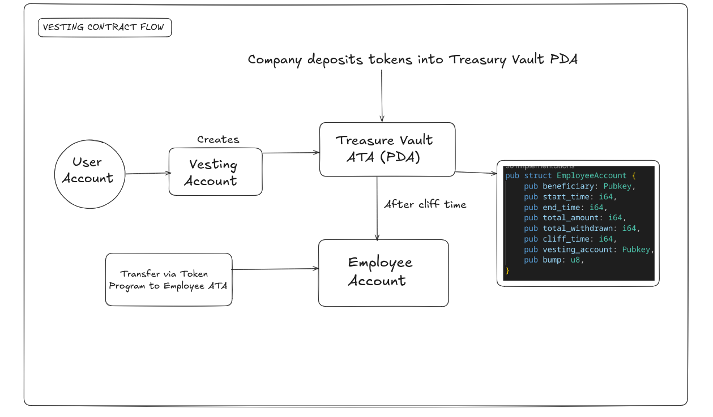

## Vesting Logic

The diagram above shows the vesting flow:

- **User Account (Company / Owner)** creates the **Vesting Account** which stores the vesting schedule & metadata.  
- Tokens are deposited into the **Treasury Vault ATA (PDA)** which securely holds the locked tokens.  
- The **Program** enforces cliff and vesting schedule rules.  
- The **Employee Account (Beneficiary)** has the right to claim tokens after the cliff time.  
- Once eligible, tokens are transferred from the vault to the employee’s ATA using the Token Program.  

